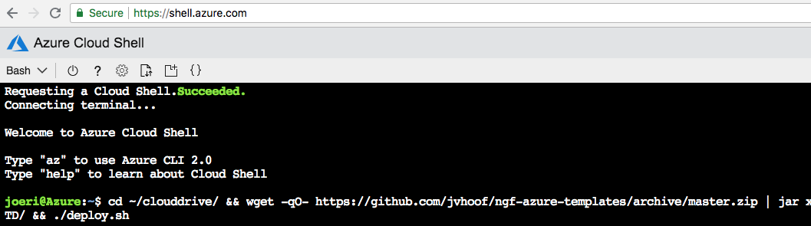
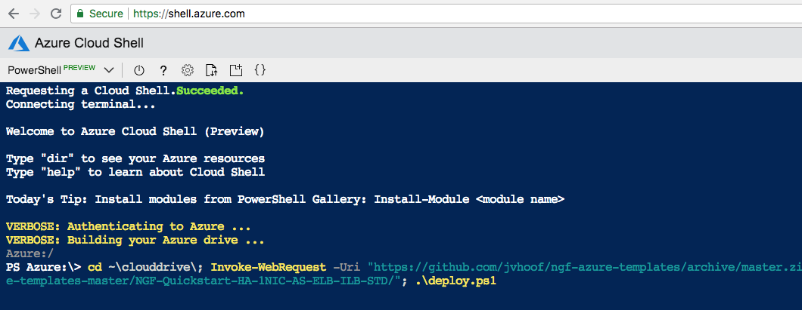
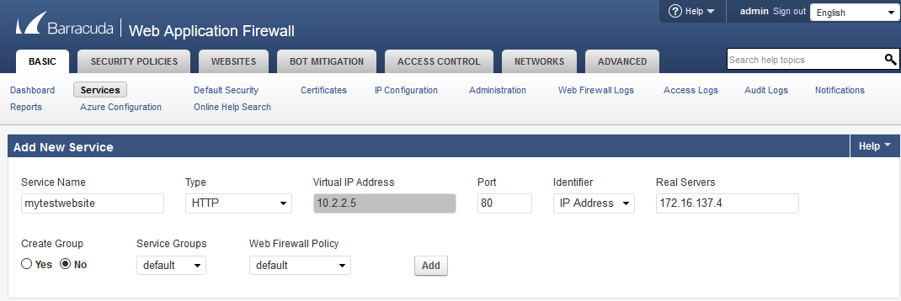
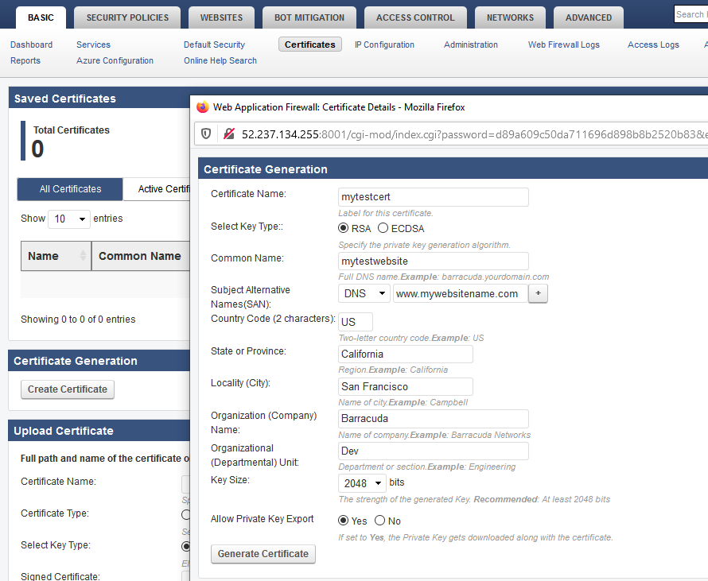
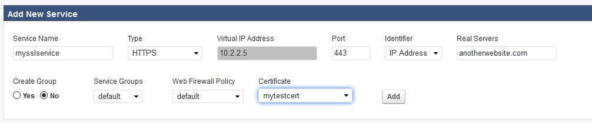

# Barracuda WAF HA Cluster

## Introduction

This template is intended to provide a complete deployment of the required components for a highly available pair of Web Application Firewalls 

## Prerequisites

The solution does a check of the template when you use the provided scripts. It does require that [Programmatic Deployment](https://azure.microsoft.com/en-us/blog/working-with-marketplace-images-on-azure-resource-manager/) is enabled for the Barracuda Web Application Firewall BYOL or PAYG images. Barracuda recommends use of **D**, **D_v2**, **D_v3**  series as these have the best power to throughput ratios 

The template will attempt to deploy PAYG instances to simplify licensing, however if testing in a CSP subscription you must select BYOL

## Deployed resources

Following resources will be created by the template:
- Two Barracuda Web Application Firewall virtual machines 
- One external Basic Azure Load Balancer containing the deployed virtual machines with a public IP and services for HTTP, HTTPS and management NAT's
- One Network Security Group attached to the WAF NIC's allowing traffic in from the internet.
- Both WAF VM's are deployed in an Availability Set

## Deployment

Deployment of the ARM template is possible via the Azure Portal, Powershell or Azure CLI. 
The package provides a deploy.ps1 and deploy.sh for Powershell or Azure CLI based deployments. This can be peformed from the Azure Portal as well as the any system that has either of these scripting infrastructures installed. Or you can deploy from the Azure Portal using the provided link.

### Azure Portal

To deploy via Azure Portal you can use the button below to deploy this reference architecture into your Azure subscription. Once you click on this the Azure Portal will ask you for your credentials and you are presented with a page to fill in minimal variables: Resource Group, Location, Admin password and Prefix.

#Remove these two when out of my test github

#These links are for the main site which this isn't published in yet'

### Azure CLI

To deploy via Azure Cloud Shell you can connect via the Azure Portal or directly to [https://shell.azure.com/](https://shell.azure.com/). 

- Start up Azure Cloud Shell from the Azure Portal or go directly to [https://shell.azure.com](https://shell.azure.com/)
- Download the latest version of the ARM templates in the persistant clouddrive:

`cd ~/clouddrive/ && wget -qO- https://github.com/barracudanetworks/cloud-reference-architectures/archive/master.zip | jar x && cd ~/clouddrive/cloud-reference-architectures-master/Quickstart-Azure-WAF-HAPair/ && ./deploy.sh`

- Answer the questions asked by the script on the following variables: location, prefix and password.

### Azure Powershell 

To deploy via Azure Cloud Shell you can connect to the Azure Cloud Shell via [https://shell.azure.com/](https://shell.azure.com/). 

- Start up Azure Cloud Shell from the Azure Portal or go directly to [https://shell.azure.com](https://shell.azure.com/)
- Download the latest version of the ARM templates in the persistant clouddrive:

`cd ~\clouddrive\; Invoke-WebRequest -Uri "https://github.com/barracudanetworks/cloud-reference-architectures/archive/master.zip" -OutFile "~/clouddrive/master.zip"; jar xf master.zip; cd "~/clouddrive/cloud-reference-architectures-master/Quickstart-Azure-WAF-HAPair/"; .\deploy.ps1`

- Answer the questions asked by the script on the following variables: location, prefix and password.

## Next Steps

Administration of the Barracuda WAF appliance is typically done by the Web GUI. Each WAF has it�s own WEB UI and you can access each WAF via the Load Balancers FQDN or Public IP.

WAF1   https://fqdn:8444
WAF2  https://fqdn:8445

If you have deployed using BYOL license types you will need to access the units on their unsecure management ports and apply a license before you can access the secure management and complete any setup. 
WAF 1: http://fqdn:8001
WAF 2: http://fqdn:8002

Note: The username to login to the appliance is admin and the password is the one you have configured on Azure portal while deploying the VM. 

## Post Deployment Configuration

- License: By default the installation uses a PAYG installation. You can change the to BYOL by changing the "imageSKU" variable in the azuredeploy.parameters.json.
  - Request a demo license for a 30 day trial via [the Barracuda eval page](https://www.barracuda.com/download/products/web-application-firewall) for the Azure deployment type
  - THe license token (xxxxx-xxxxx-xxxxx) will be send by email. To activate the Barracuda Web Application Firewall you can follow the instructions [here](https://campus.barracuda.com/product/cloudgenfirewall/doc/79463375/how-to-activate-and-license-a-standalone-high-availability-cluster/)
- Deploy a web server VM if you don't have a site to test with already. The WAF can work with external sites via FQDN. 
- Create a service to serve a site via the WAF

  - Under the Basic tab, click on Services. 

Note: If you wish to test using certificates go to the Basic > Certificates tab and create a new self-signed certificate before creating a service.

Now when you create your service you can select the certificate.

  - Once you have created the service the website should become available via the WAF, you may need to make host file entries if your webserver expects host names to match. Please see campus for more options or reach out to azure_support@barracuda.com for assistance. 

*It is also recommended you harden management access by now making the NSG rules for port 8001 & 8002 blocks.*

### Further Actions
1. The WAF's are not automatically clustered by default, at any stage you can complete the clustering via the UI.  [Instructions](https://campus.barracuda.com/product/webapplicationfirewall/doc/4259898/how-to-set-up-a-high-availability-environment-with-two-barracuda-web-application-firewalls/)
2. Logs from the WAF's can be exported to an external SIEM system following these steps. [Instructions](https://campus.barracuda.com/product/webapplicationfirewall/doc/4259935/how-to-export-logs-from-the-barracuda-web-application-firewall)
3. 
## Template Parameters
| Parameter Name | Description
|---|---
adminPassword | Password for the Firewall Admin tool
prefix | identifying prefix for all VM's being build. e.g WeProd would become WeProd-VM-NGF (Max 19 char, no spaces, [A-Za-z0-9]
dnsNameForLBIP | Prefix for the FQDN assigned by Microsoft to the load balancers public IP.
vNetAddressSpace | Range of the VNET to be deployed into
subnetWAF | Range of the subnet that the WAF's are to be placed in
subnetRed | Range of the subnet to be used for web server test VM's
imageSKU | SKU Hourly (PAYG) or BYOL (Bring your own license) for the WAF's
vmSize | Size of the VMs to be created - applies to all the boxes

